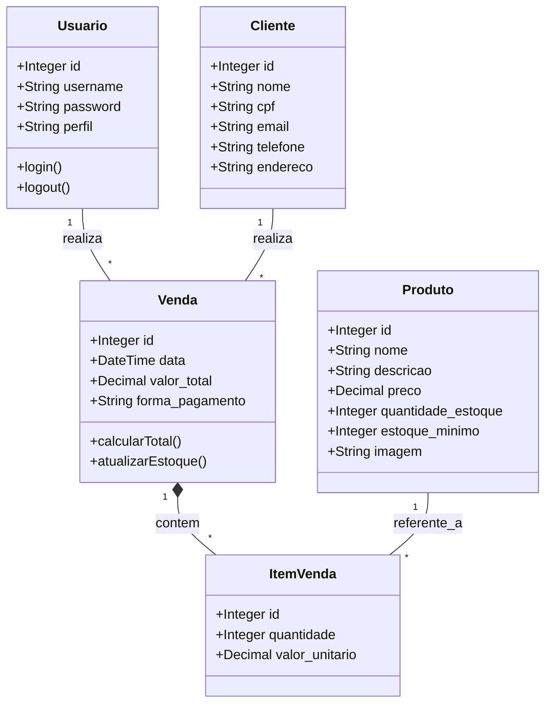
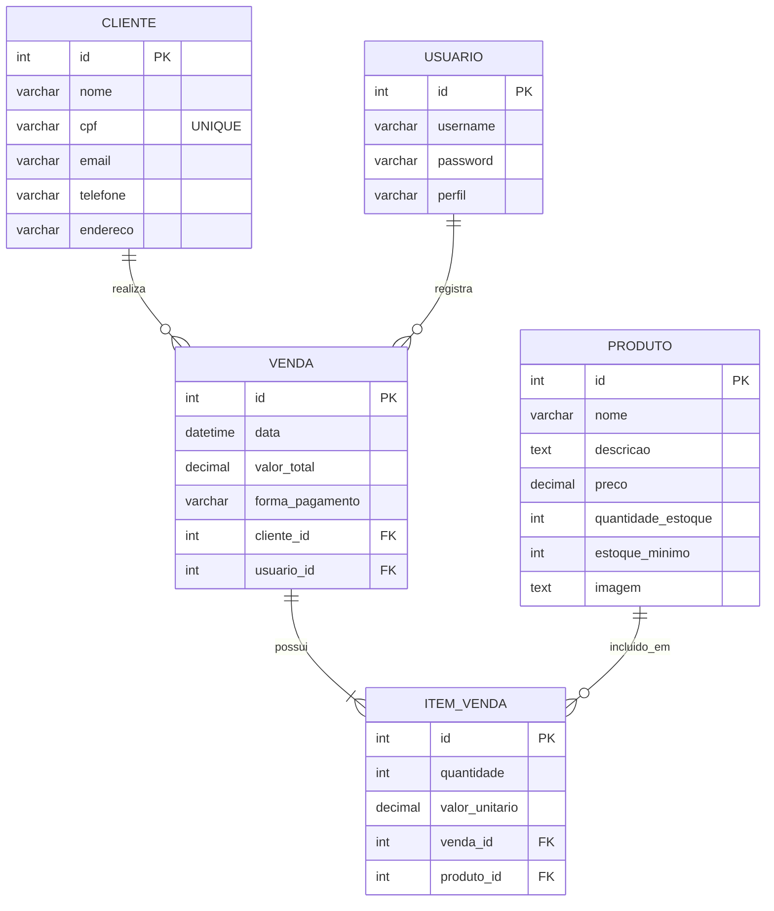

# Sistema de Gestão Comercial para Pequenos Negócios (SGC)
## Documentação Técnica Detalhada

> **Instruções para o Aluno:** Copie o conteúdo abaixo e cole no seu trabalho (Word, PDF, Notion, etc). Para os diagramas gerados em código, você pode colar os blocos de código em sites como [Mermaid Live Editor](https://mermaid.live/) para gerar as imagens em PNG e colar no seu documento.

---

### 1. Casos de Uso Principais

**CDU01: Realizar Autenticação (Login)**
- **Ator:** Usuário (Dono ou Funcionário)
- **Descrição:** O usuário insere suas credenciais (usuário e senha criptografada). O sistema valida no banco de dados e retorna um Token JWT com tempo de expiração para liberar o acesso ao sistema.
- **Regras:** Proteção de rotas ativada. Sem o token, não é possível acessar endpoints protegidos.

**CDU02: Gerenciar Produtos**
- **Ator:** Dono / Funcionário
- **Descrição:** Permite o cadastro, edição, listagem e exclusão de produtos do catálogo.
- **Regras:** Preço não pode ser negativo. O sistema armazena a quantidade em estoque, o estoque mínimo de segurança e permite salvar a imagem do produto em formato Base64. 

**CDU03: Gerenciar Clientes**
- **Ator:** Dono / Funcionário
- **Descrição:** Cadastro e manutenção da base de clientes do estabelecimento.
- **Regras:** O CPF é validado como único (`UNIQUE`) no banco de dados. Um cliente que já possui vendas atreladas ao seu ID não pode ser excluído do sistema (Regra de Restrição de Chave Estrangeira - `RESTRICT`).

**CDU04: Registrar Venda (Ponto de Venda - PDV)**
- **Ator:** Dono / Funcionário
- **Descrição:** O usuário seleciona o cliente, adiciona os produtos ao carrinho e finaliza a venda definindo a forma de pagamento.
- **Regras:** O valor total é calculado automaticamente pelo backend (soma de `valor_unitario * quantidade`). Não é possível vender um produto com quantidade superior ao estoque atual. O sistema subtrai automaticamente o estoque após a conclusão da venda.

**CDU05: Emitir Relatório e Dashboard Anual**
- **Ator:** Dono (Acesso Restrito)
- **Descrição:** O sistema consolida todas as vendas realizadas e as agrupa em um gráfico de faturamento anual (de Janeiro a Dezembro). O ator pode aplicar filtros de data inicial, data final e cliente específico na listagem de vendas.

---

### 2. Diagrama de Classes (UML)

Copie o código abaixo e cole no [Mermaid Live](https://mermaid.live/) para gerar a imagem.

---

### 3. Diagrama Lógico do Banco de Dados (ER)

Copie o código abaixo e cole no [Mermaid Live](https://mermaid.live/) para gerar a imagem.

---

### 4. Manual do Usuário

**Visão Geral do Sistema**
O AimSync SGC é uma plataforma web completa para controle de pequenos comércios. O sistema foi projetado com uma interface intuitiva ("Dark Mode" moderno) que se adapta perfeitamente a computadores de balcão.

**Primeiro Acesso**
1. Acesse a URL do sistema no navegador.
2. Insira as credenciais de acesso padrão (ou criadas via registro).
3. Se o seu perfil for "DONO", você terá acesso a todo o painel de faturamento (Dashboard) e controle da Equipe.
4. Se o perfil for "FUNCIONARIO", você será redirecionado imediatamente para a tela de Vendas.

**Como Cadastrar Produtos e Clientes**
- No menu lateral, acesse "Produtos" ou "Clientes".
- Clique no botão "+ Adicionar".
- Preencha os campos obrigatórios (nome, CPF, preço, estoque).
- Você pode anexar imagens ao produto. O sistema automaticamente transforma a foto num formato otimizado e seguro para salvamento.

**Como Registrar uma Venda (PDV)**
- Acesse a aba "Vendas".
- Selecione o cliente no topo da tela. Se for um cliente eventual, deixe como "Consumidor Final" (ou cliente genérico).
- Clique nas imagens dos produtos para adicioná-los ao carrinho. O estoque disponível é exibido na tela em tempo real.
- Revise o subtotal, escolha a forma de pagamento e clique em "Finalizar Compra". O estoque é atualizado instantaneamente.
- Após isso, vá na aba "Notas Fiscais" para gerar e imprimir o recibo da venda efetuada.
