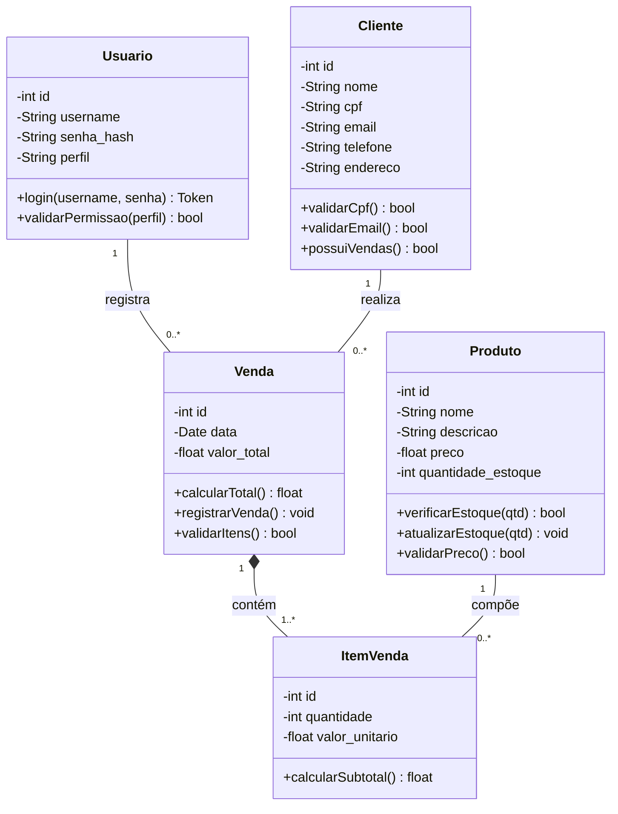
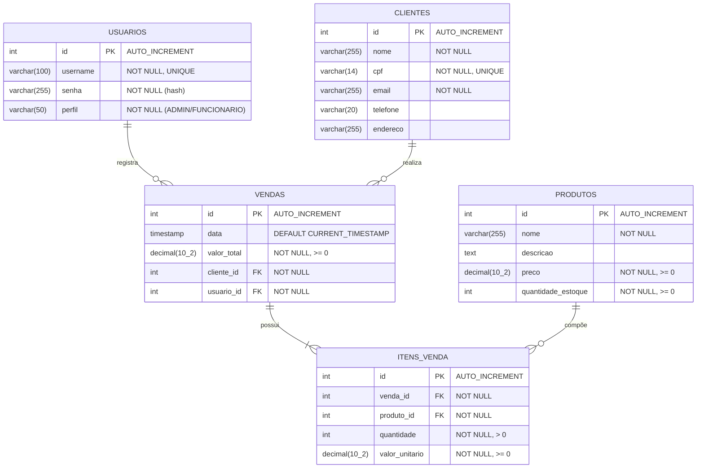

# AimSync - Entrega 1: Modelagem e Arquitetura

---

## 1. Descrição do Sistema

O **AimSync** é um Sistema de Gestão Comercial (SGC) desenvolvido para atender às necessidades operacionais de pequenos negócios, como lojas de informática, papelarias, livrarias e assistências técnicas. O sistema centraliza e automatiza processos essenciais do dia a dia comercial: o cadastro e gerenciamento de clientes, o controle de produtos e estoque, o registro de vendas e a geração de relatórios estratégicos.

O objetivo principal do AimSync é fornecer ao comerciante uma ferramenta intuitiva e segura que permita:
- Manter um cadastro organizado de clientes com validação de dados (CPF único, e-mail válido).
- Controlar o inventário de produtos com alertas de estoque mínimo e atualização automática após vendas.
- Registrar vendas de forma ágil, com cálculo automático do valor total e vínculo ao cliente e ao funcionário responsável.
- Gerar relatórios de vendas filtrados por período e por cliente, incluindo representações gráficas para apoio à tomada de decisão.

O sistema é acessado via navegador web e opera com uma API REST protegida por autenticação JWT, garantindo segurança e controle de acesso diferenciado entre perfis de usuário (Administrador e Funcionário).

---

## 2. Requisitos Funcionais

| ID   | Requisito                  | Descrição                                                                                              |
|------|----------------------------|--------------------------------------------------------------------------------------------------------|
| RF01 | Gestão de Clientes         | O sistema deve permitir cadastrar, listar, editar e remover clientes.                                  |
| RF02 | Validação de CPF           | O CPF deve ser único no sistema; não é permitido cadastrar dois clientes com o mesmo CPF.              |
| RF03 | Validação de E-mail        | O e-mail informado deve possuir formato válido.                                                        |
| RF04 | Restrição de Exclusão      | Um cliente não pode ser removido caso possua vendas registradas no sistema.                            |
| RF05 | Gestão de Produtos         | O sistema deve permitir cadastrar, listar, editar e remover produtos.                                  |
| RF06 | Controle de Preço          | O preço de um produto não pode ser negativo.                                                           |
| RF07 | Controle de Estoque        | O sistema deve controlar o estoque mínimo e impedir vendas quando o estoque for insuficiente.          |
| RF08 | Registro de Vendas         | O sistema deve permitir registrar vendas vinculando cliente, itens e o usuário responsável.             |
| RF09 | Cálculo Automático         | O valor total da venda deve ser calculado automaticamente com base nos itens e suas quantidades.        |
| RF10 | Atualização de Estoque     | Após o registro de uma venda, o estoque dos produtos vendidos deve ser atualizado automaticamente.      |
| RF11 | Venda com Itens            | Não é permitido registrar uma venda sem ao menos um item.                                              |
| RF12 | Autenticação               | O sistema deve possuir endpoint de login que retorne um token JWT.                                     |
| RF13 | Controle de Acesso         | O sistema deve restringir funcionalidades conforme o perfil do usuário (ADMIN ou FUNCIONÁRIO).          |
| RF14 | Relatório por Período      | O sistema deve gerar relatórios de vendas filtrados por data inicial e final.                           |
| RF15 | Relatório por Cliente      | O sistema deve exibir o histórico de vendas de um cliente específico.                                  |
| RF16 | Gráficos de Vendas         | O sistema deve construir representação gráfica (charts) das vendas anuais.                             |

---

## 3. Requisitos Não Funcionais

| ID    | Requisito                   | Descrição                                                                                                      |
|-------|-----------------------------|-----------------------------------------------------------------------------------------------------------------|
| RNF01 | Arquitetura em Camadas      | O sistema deve ser construído seguindo a arquitetura em camadas (Apresentação, Negócio, Persistência).         |
| RNF02 | API REST                    | O backend deve expor endpoints REST retornando JSON em todas as respostas.                                     |
| RNF03 | Segurança - JWT             | A autenticação deve utilizar tokens JWT com tempo de expiração configurável.                                    |
| RNF04 | Segurança - Senhas          | As senhas devem ser armazenadas com hash seguro (BCrypt ou equivalente).                                       |
| RNF05 | Banco de Dados Relacional   | O sistema deve utilizar banco de dados relacional (PostgreSQL) com integridade referencial.                    |
| RNF06 | Interface Web               | A interface gráfica deve ser web e deve consumir a API REST via requisições HTTP assíncronas (fetch/AJAX).      |
| RNF07 | Versionamento               | O código-fonte deve ser versionado com Git e hospedado no GitHub com commits organizados.                      |
| RNF08 | Manutenibilidade            | O código deve seguir boas práticas de organização, nomenclatura e separação de responsabilidades.              |
| RNF09 | Desempenho                  | As consultas ao banco devem ser otimizadas; listagens devem suportar paginação quando necessário.              |

---

## 4. Arquitetura Proposta

O AimSync adota uma **arquitetura em camadas**, separando claramente as responsabilidades do sistema:

```
┌──────────────────────────────────────────────────┐
│              CAMADA DE APRESENTAÇÃO               │
│   (Interface Web - HTML/CSS/JS + Django Templates)│
│   Consome a API REST via fetch/AJAX               │
├──────────────────────────────────────────────────┤
│               CAMADA DE API / CONTROLE            │
│   (Django REST Framework - Views/Serializers)     │
│   Endpoints REST, validação de entrada,           │
│   autenticação JWT, controle de permissões        │
├──────────────────────────────────────────────────┤
│            CAMADA DE NEGÓCIO / SERVIÇOS           │
│   (Services / Business Logic)                     │
│   Regras de negócio, cálculos de venda,           │
│   validações de CPF, controle de estoque          │
├──────────────────────────────────────────────────┤
│             CAMADA DE PERSISTÊNCIA                │
│   (Django ORM / Models)                           │
│   Mapeamento objeto-relacional,                   │
│   acesso ao banco de dados PostgreSQL             │
└──────────────────────────────────────────────────┘
```

### Fluxo de uma Requisição
1. O **usuário** interage com a interface web (camada de apresentação).
2. A interface faz uma **requisição HTTP** para a API REST, enviando o token JWT no cabeçalho.
3. A **camada de API** valida o token, verifica permissões e repassa a solicitação para a camada de negócio.
4. A **camada de negócio** aplica as regras (ex: verificar estoque, calcular total da venda).
5. A **camada de persistência** executa as operações no banco de dados via ORM.
6. A resposta retorna em **formato JSON** até a interface, que atualiza a tela.

---

## 5. Padrões de Projeto Escolhidos

### 5.1 MVT (Model-View-Template)
Padrão nativo do Django que separa as responsabilidades em:
- **Model:** Define a estrutura dos dados e interage com o banco.
- **View:** Processa a lógica de requisição/resposta e coordena os serviços.
- **Template:** Renderiza a interface para o usuário.

**Justificativa:** O Django já implementa esse padrão nativamente, garantindo organização e separação de responsabilidades desde a base do projeto.

### 5.2 Service Layer (Camada de Serviço)
As regras de negócio complexas (como cálculo de vendas, atualização de estoque e validações de CPF) são isoladas em módulos de serviço (`services.py`), evitando que as Views fiquem sobrecarregadas.

**Justificativa:** Melhora a testabilidade e manutenibilidade do código, permitindo que regras de negócio sejam alteradas sem impactar as camadas de controle ou apresentação.

### 5.3 Repository / DAO (Data Access Object)
Abstraído pelo ORM do Django (QuerySets e Managers), esse padrão centraliza o acesso aos dados em um único ponto. Consultas complexas são encapsuladas em métodos customizados nos Managers dos Models.

**Justificativa:** Garante que a lógica de acesso a dados fique desacoplada da lógica de negócio, facilitando a troca do banco de dados no futuro se necessário.

### 5.4 Serializer Pattern
Utilizado pelo Django REST Framework, os Serializers convertem objetos Python em JSON (e vice-versa), além de validar os dados de entrada antes de processá-los.

**Justificativa:** Centraliza a validação e transformação de dados de entrada/saída da API, reduzindo duplicação de código e garantindo consistência.

---

## 6. Casos de Uso

### UC01 - Realizar Login
- **Ator:** Usuário (Admin ou Funcionário)
- **Pré-condição:** Usuário deve estar cadastrado no sistema.
- **Fluxo Principal:**
  1. O usuário acessa a tela de login.
  2. Informa username e senha.
  3. O sistema valida as credenciais.
  4. O sistema gera e retorna um token JWT.
  5. O usuário é redirecionado para o painel principal.
- **Fluxo Alternativo:** Credenciais inválidas → sistema retorna erro 401.

### UC02 - Cadastrar Cliente
- **Ator:** Funcionário ou Admin
- **Pré-condição:** Usuário autenticado.
- **Fluxo Principal:**
  1. O usuário acessa o formulário de cadastro de clientes.
  2. Preenche os dados (nome, CPF, e-mail, telefone, endereço).
  3. O sistema valida o CPF (unicidade) e o e-mail (formato).
  4. O sistema persiste o cliente no banco de dados.
  5. Retorna mensagem de sucesso.
- **Fluxo Alternativo:** CPF duplicado ou e-mail inválido → sistema retorna erro com detalhes.

### UC03 - Cadastrar Produto
- **Ator:** Admin
- **Pré-condição:** Usuário autenticado com perfil ADMIN.
- **Fluxo Principal:**
  1. O usuário acessa o formulário de cadastro de produtos.
  2. Preenche os dados (nome, descrição, preço, quantidade em estoque).
  3. O sistema valida o preço (não negativo) e o estoque.
  4. O sistema persiste o produto no banco de dados.
  5. Retorna mensagem de sucesso.

### UC04 - Registrar Venda
- **Ator:** Funcionário ou Admin
- **Pré-condição:** Usuário autenticado; pelo menos um cliente e um produto cadastrados.
- **Fluxo Principal:**
  1. O usuário seleciona o cliente da venda.
  2. Adiciona itens (produto + quantidade) à venda.
  3. O sistema verifica o estoque disponível de cada item.
  4. O sistema calcula o valor total automaticamente.
  5. O sistema registra a venda, vinculando o usuário responsável.
  6. O estoque de cada produto é atualizado.
- **Fluxo Alternativo:** Estoque insuficiente → sistema bloqueia a adição do item e exibe alerta.

### UC05 - Consultar Relatórios
- **Ator:** Admin
- **Pré-condição:** Usuário autenticado com perfil ADMIN.
- **Fluxo Principal:**
  1. O usuário acessa a seção de relatórios.
  2. Seleciona o tipo de relatório (por período ou por cliente).
  3. Informa os filtros desejados.
  4. O sistema consulta as vendas e retorna os dados em formato de tabela e/ou gráfico.

### UC06 - Gerenciar Clientes (Editar/Excluir)
- **Ator:** Funcionário ou Admin
- **Pré-condição:** Usuário autenticado.
- **Fluxo Principal (Editar):**
  1. O usuário seleciona um cliente da listagem.
  2. Altera os dados desejados.
  3. O sistema valida e persiste as alterações.
- **Fluxo Principal (Excluir):**
  1. O usuário solicita a exclusão de um cliente.
  2. O sistema verifica se o cliente possui vendas registradas.
  3. Se não possuir, o cliente é removido. Se possuir, o sistema retorna erro.

### UC07 - Gerenciar Produtos (Editar/Excluir)
- **Ator:** Admin
- **Pré-condição:** Usuário autenticado com perfil ADMIN.
- **Fluxo Principal:** Análogo ao UC06 para produtos.

---

## 7. Diagrama de Classes



---

## 8. Diagrama Lógico do Banco de Dados



---

## 9. Justificativa das Decisões Técnicas

| Decisão                  | Justificativa                                                                                           |
|--------------------------|---------------------------------------------------------------------------------------------------------|
| **Django + DRF**         | Framework robusto para web com suporte nativo a ORM, autenticação e geração de APIs REST.               |
| **PostgreSQL**           | Banco relacional confiável, com suporte a constraints, transações e escalabilidade.                     |
| **JWT**                  | Padrão amplamente adotado para autenticação stateless em APIs REST, com controle de expiração.          |
| **Arquitetura em Camadas** | Facilita manutenção, testabilidade e evolução do sistema de forma independente por camada.            |
| **Service Layer**        | Isola regras de negócio críticas, evitando Views "gordas" e facilitando testes unitários.               |
| **BCrypt**               | Algoritmo de hash seguro e resistente a ataques de força bruta para armazenamento de senhas.            |

---
